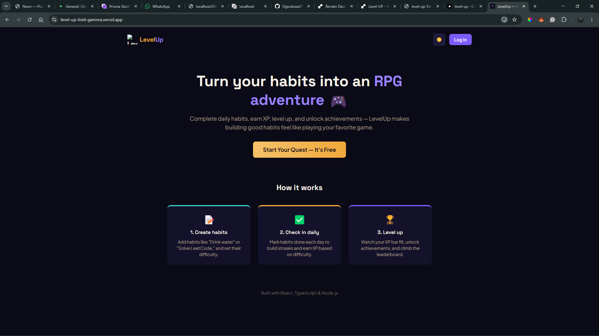

# LevelUp 🎮

Turn your habits into an RPG adventure. Complete daily habits, earn XP, level up, build streaks, and unlock achievements — LevelUp makes building good habits feel like playing your favorite game.

**Live demo:** _[add your deployed link here once live]_


_(add a screenshot here — see "Adding Screenshots" below)_

---

## Features

- 🔐 **Auth** — secure registration/login with JWT and bcrypt password hashing
- 📝 **Habit tracking** — create habits with custom categories, difficulty (Easy/Medium/Hard), and frequency
- ⭐ **XP & Leveling** — completing habits earns XP based on difficulty; XP accumulates into levels
- 🔥 **Streaks** — daily check-ins build streaks, tracked per-habit with longest-streak history
- 🏅 **Achievements** — 10 unlockable achievements based on streaks, XP milestones, and habit count
- 📊 **Stats dashboard** — a 7-day check-in chart plus at-a-glance totals (check-ins, best streak, active habits)
- 🌗 **Dark / light mode** — full theme support with persisted preference
- 📱 **PWA** — installable on desktop and mobile, works like a native app

## Tech Stack

**Frontend**
- React 18 + TypeScript
- Tailwind CSS v4
- TanStack Query (server state / caching)
- React Router
- Recharts (data visualization)
- Vite + `vite-plugin-pwa`

**Backend**
- Node.js + Express
- PostgreSQL via Prisma ORM
- JWT authentication + bcrypt

**Hosting**
- Database: Supabase (Postgres)
- _[Frontend/backend hosting — add once deployed]_

## Architecture Notes

A few implementation details worth highlighting:

- **Atomic XP transactions** — check-ins, streak updates, and XP awards happen inside a single Prisma `$transaction`, so a partial failure can't award XP without recording the check-in (or vice versa).
- **Timezone-safe date handling** — daily stats and streak calculations use local calendar dates rather than UTC, avoiding the classic "logged a habit but it shows on the wrong day" bug around midnight.
- **Ownership checks on every mutation** — habit updates/deletes verify the requesting user actually owns the habit before touching it, not just that the habit exists.

## Getting Started

### Prerequisites
- Node.js 18+
- A PostgreSQL database (e.g. free tier on [Supabase](https://supabase.com) or [Neon](https://neon.tech))

### Setup

1. **Clone the repo**
   ```bash
   git clone https://github.com/Ogooluwa07/levelup-habit-tracker.git
   cd levelup-habit-tracker
   ```

2. **Backend setup**
   ```bash
   cd server
   npm install
   ```

   Create a `.env` file in `server/`:
   ```
   DATABASE_URL="your-postgres-connection-string"
   DIRECT_URL="your-postgres-direct-connection-string"
   JWT_SECRET="your-random-secret-string"
   ```

   Push the schema and seed achievements:
   ```bash
   npx prisma db push
   npx prisma generate
   npx tsx prisma/seed.ts
   ```

   Start the server:
   ```bash
   npm run dev
   ```

3. **Frontend setup** (in a new terminal)
   ```bash
   cd client
   npm install
   npm run dev
   ```

4. Visit `http://localhost:5173`

## Project Structure

```
levelup-habit-tracker/
├── client/               # React frontend
│   └── src/
│       ├── components/   # Reusable UI (HabitCard, XPBar, StatsPanel, etc.)
│       ├── context/      # Auth + Theme global state
│       ├── lib/          # API client + typed data-fetching functions
│       └── pages/        # Landing, Auth, Dashboard
└── server/               # Express backend
    └── src/
        ├── controllers/  # Route logic (auth, habits, achievements, stats)
        ├── middleware/    # JWT auth guard
        ├── routes/       # Express route definitions
        └── lib/          # Prisma client singleton
```

## Roadmap

- [ ] Habit editing UI (backend endpoint already exists)
- [ ] Friends / leaderboard
- [ ] Rewards shop (coin economy)
- [ ] AI-suggested habits

## License

MIT
